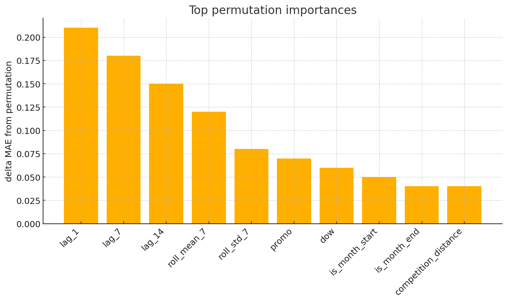

# ForwardChain Forecasting
Leak free panel time series modeling with forward chaining and feature ablations



## Overview
I built this project to show how one can approach forecasting under a real temporal constraint. It started as one of my UC Berkeley work and I refactored it into a small library and a training script. The design transfers directly to multi asset modeling where Store becomes Ticker and Sales becomes a forward return target.

## What is inside
* Reusable sklearn pipeline for panel time series
* Safe per entity lags and rolling features with honest alignment
* Forward chaining evaluation with out of fold reporting
* Permutation importance and clear plots
* Tests that guard against temporal leakage

## Quick start
1. Create a fresh virtual environment
2. Install the dependencies from requirements.txt
3. Put train.csv and store.csv from the Rossmann dataset under data or point the config to your location
4. Run the training script
   
   ```
   python scripts/train.py
   ```
5. Review metrics in results and figures in figures
6. Open notebooks uc_berkeley_work.ipynb if you want to see the original work

## Data layout
* Expected columns include Date Store Sales Promo and the static store metadata
* The config names the id column the date column and the target

## Method in brief
* Per entity lags and rolling statistics computed on the shifted target
* A small gradient boosted tree baseline tuned with a compact grid
* Forward chaining cross validation with honest out of fold metrics
* Permutation importance on the last validation split and a saved figure

## Mapping to trading
* Replace Store with Ticker
* Replace Sales with a future return target over your chosen horizon
* Keep the same feature functions and evaluation flow

## Reproduce or extend
* Change configs default.yaml to adjust lags windows and model settings
* Add new features in src forwardchain features.py
* Swap in alternative models in src forwardchain model.py
* Extend the script to produce rolling retrain backtests

## Results
* After you run the training script you will find metrics.json and feature_importance.csv under results and a top importances figure under figures

## Repository structure
* configs default.yaml
* src forwardchain data.py features.py model.py cv.py importance.py plots.py
* scripts train.py
* tests test_leakage.py test_features.py
* docs overview.md
* notebooks uc_berkeley_work.ipynb
* results metrics.json will be created on run
* figures top10_importances.png will be created on run

## License
MIT
